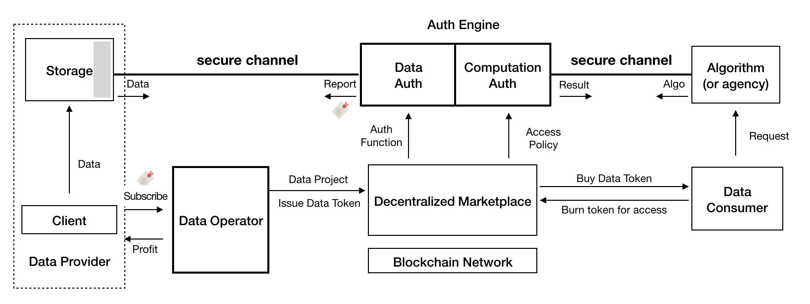

#Auth3 Whitepaper

##Introduction

##Background & Motivation

Web 3.0 has been recogonized as the next station of the Web. It is still being built and there is no established definition of what Web 3.0 is yet. When we are talking about Web 3.0, we are depicting an open, permissionless world with full-decentralization, privacy-preserving and freely value exchange. To truly understand what Web 3.0 can bring to us, we need to figure out what we are facing in the current network.

###Challenges
From Web 1.0 to Web 2.0, centralized intermediaries brought us efficient, intensive and full-featured platforms and services to coordinate, interact and trade with other counterparties. People get used to this and enjoy the convenience. However, everything comes at a price. We get more dependent on these powerful intermediaries and would like to provide our personal data and information freely. As the owner of these data, we become the property of those companies and organizations. Our data makes great profits, yet we get nothing but risk of privacy exposure and invasion.

Concretely, personal data intrinsically contains tremendous value, e.g., the user labels and portraits are essential support for industries including advertising, insurance, medical and artificial intelligence, which brings a $trillion-level marketplace. Due to lack of effective and legal ways for data usage, the value is dramatically constrained and distributed inequitably.

* User's multi-dimensional data is scattered across various Internet companies.
* The powerful companies force users to authorize and make money of these data.
* Users are completely unconscious of how the data is spreaded and used.
* There is no clear responsibilities for accidents such as users' data loss or leakage, which has actually happened frequently.

###AUTH3 wants to make a change

According to Coase theorem[COASE1966], we know that when the transaction cost is zero or low enough, no matter who the original owner of the resource is, the resource will finally flow to the most valuable usage scenario. This explains why the huge amount of data is handled by a set of centralized entities, cuz they know how to explore the value of data efficiently. In another aspect, the data scattered across the Internet results in plenty of data silos, which notably impedes the exploitation of valuable data.

Given all above, the ultimate goal of AUTH3 is to unleash the value of data, help people discover, aggregate and equitably exchange their authentic data assets, connect people and data around the world. In AUTH3, you will 1) own your data, 2) control your data, 3) entitled to sell the right of your data usage without disclosure your privacy and get paid for that. To achieve this, we will replace the current excessive centralization by a truly decentralized, autonomous and privacy-preserved marketplace, where:

* Data sovereignty and the right for usage are decoupled completely.
* Data is monetized into Data Tokens, which can be circulated for transaction and consumption of the data assets, by leveraging the booming DeFi like AMM[1] DEX[2].
* People can launch a data project, mint data tokens, and appeal for data provision (aka data staking), or can join a data project, provide/stake data as required. They earn data tokens as rewards.
* Data must always be authorized by the owners, and the data is verified to be authentic and not tampered by using privacy computing technology like TEE, MPC and federated learning.
* Privacy computing technology is also utilized to guarantee that "data is usable but not visible", which means the data itself is not directly shared but rather the comuting value.
* Data always stays on-premise, with full compliance with the data protection regulations like GDPR, CCPA, Data Security Law of the People’s Republic of China, etc.

###Values

AUTH3 is not only a network for the future, it's also
* A revolution for the fight for data sovereignty, the new paradigm of data circulation and transaction, and entirely release of data values.
* A community comprised of different people, enterprises and organizations, where every single one can coordinate and meet their data requirements, exchange data assets in an equitable and autonomous way.
* An ecosystem that sustainably spreads values and keeps long-term & healthy growing, via a community self-governed supervision and grant mechanism called Auth3 DAO.

[1] As known as "Automated Market Maker"
[2] As known as "Decentralized Exchange"
References
[COASE1966] "Coase theorem", Wikipedia. https://en.wikipedia.org/wiki/Coase_theorem

##High-level architecture

###Design Objectives
* An open data monetization platform. It aims to provide continuous and sufficient liquidity for data assets, and realize the release and continuous growth of data value.
* General private data processing scheme. It is not just the secure execution process,  but also the authentication process of data quality under the premise of privacy protection.
* Transparent and secure data aggregation and operation mechanism. It decouples data control and data operation by introducing experts or building automatic operation tools to guide data providers to build truly valuable data sets and coordinate data supply and demand.
* Flexible and extensible marketplace. According to different data types and data scenarios, it should be allowed to create different market tools to provide users (e.g., data providers, data consumers, data operators...) with a simpler way to participate. 

###The Architecture
The high-level system design of Auth3 is shown in Figure 1, the kernel of Auth3 network consists of three modules:

Figure 1: The architecture

* As the initiator of data projects, **Data Operator** will carry out a series of work related to data set construction, operation and maintenance, including defining data standards, data auth functions and other operation strategies. In the mean time, as the issuer of data token, **Data Operator** will choose (or design by itself) an appropriate economic model to tokenize the data set that it operates, and coordinate various roles in the data market. The source data may not belong to **Data Operator**, but **Data Operator** will determine the operation strategy, revenue distribution rules and other rights of data. At the beginning of Auth3 project, we plan to encourage people or institutions with operation experience in various data fields to act as early data operators. In the future, the community can spontaneously set up automatic operation facilities to build data projects after various market tools become mature. 

* **Auth Engine**, as a reliable neutral party, will undertake two main responsibilities: data authentication and secure execution. **Auth Engine** runs in the environment protected by TEE (Trust Execution Environment) to ensure the privacy and integrity of internal execution process. On the one hand, the data authentication process will execute the auth function defined by **Data Operator**, accept the source data from the data provider through a secure channel, and return the authentication result to **Data Operator** as basis for data value evaluation. On the other hand, **Auth Engine** will provide a general secure computing environment that is used to execute the algorithm defined by the consumer ensuring that the data is used without disclosure.

* **Marketplace** is the place for data value circulation where **Data Operator** can start data projects and issue data tokens, and data consumers can issue data requests and complete the secure computation of data. It will provide a series of market tools (such as token framework, transaction pools, board, etc.) to help **Data Operator**  build a dynamic data market. **Marketplace** should be a sustainable system. All kinds of infrastructure of Auth3 will provide powerful help for it, and the revenue generated in **Marketplace** will be partly used to feedback these participants in turn.

The outside part in Figure 1 is the users of Auth3 network, including **data provider**, **data consumer** and liquidity provider. **Data provider** can be large institutions or just individuals, who will continue to gain benefits by providing verifiable valuable data. **Data consumers** can explore valuable data in various kinds of data markets and pay the corresponding data token to obtain the access rights of the data. This revenue will be mainly distributed to the **data provider**, and the other part will be used to feedback other contributors in the network. **Liquidity provider** will provide liquidity for all kinds of data tokens in the network by staking Auth3 token, and obtain liquidity reward.

# 4. Building Blocks

## 4.1 Overview

This section introduces the technical part of **Auth3 protocol**, whose overview is shown in the above figure. The key roles (or components) of Auth3 are:

+ **Data Provider**: To provide data in Auth3 protocol, data provider (also called **DP**) needs to run two components: **user client** and a **storage**. The previous one is provided by Auth3 protocol and is used to communicate with other components in Auth3 network (e.g., the Auth Engine). The later one is used to save the user data and this component is constructed by the DP. For example, it can be an application running on DP's machine or a third-party service which is rented by the DP. DP's data will only stored in the **DP-controlled storage** to enforce data privacy.

  

+ **Data Operator**: The role who helps multiple data providers to aggregate their data and publish them on Auth3 network. Data operator needs to validate the value of aggregated data and publish the data token. Auth3 protocol provides tools to perform these behaviors (details can be found in [Section 4.3](#4.3 Data Operator)). 

  

+ **Auth Engine**: It is an important component in Auth3 network. During data assets publication, Auth Engine verified the ownership and value of the data. During data exchanging, it protects and verifies the exchange procedure. We will introduce details about Auth Engine in [Section 4.2](#4.2 Auth Engine). 

  

+ **Marketplace**: It is a decentralized market for publishing, discovering and exchanging data assets. Marketplace is consist of multiple onchain smart contracts, which implements the service logics. Besides them, we will also provide several frontend window (e.g., applications or website) for different roles to interact with the market place.

  

+ **Data Consumer and Algorithm**: The role who pays for the data and consums the value of data. Auth3 protocol provides **client** for the consumer to burn the data token and use the data. In our protocol, consumer needs to leverage a **data-usage algorithm** to use the data, and get the result returned by the algorithm. The execution will be performed in **Auth engine** to enforce the data privcay. 

  The data-usage algorithm can be implemented by any developer or the consumer herself. **Auth3DAO** will audit the algorithm ([Section 4.6](#4.6 Auth3DAO)) and **data operator** could deployed access policy to specify which algorithm can be used on her data project ([Section4.3](#4.3 Data Operator)). 

  

## 4.2 Auth Engine

### 4.2.1 What is Auth Engine？

The main goal of Auth3 protocol is to aggregate data assets from different people and help peoples to exchange their data assets.  During the data assets exchanging, a key problem is "**How to provide the authentication for data assets ?**". Once we try to transfer data to data asset, the intellectual property (IP), authenticity and quality need to be verified, specially for the personal data. In our protocol,  **Auth engine** takes responsibility to perform the authentication.

To perform authentication in the whole lifecycle of data assets exchanging, Auth engine provides two kinds of functionalities:

+ **Data Auth**: Before we try to exchange something, we must confirm its ownership and the value. For the data asset, we should verified its ownership, as well as its authenticity and quality. Because of that, Auth engine will perform *Data Auth*, which verifies the data intellectual property (a.k.a. the data owner), the authenticity of data and the quality of the data. Auth engine will generate a **data report** for the verified data asset. Thereafter, anyone can evaluate the ownership and value of the data asset by verifying its **data report**.

  

+ **Computation Auth**: After the data asset has been authenticated, it can be exchanged. The exchanging procedure itself should be authenticated. Auth engine provides *Computation Auth* to protect the whole data exchanging procedure, from data feeding to result returning. In **Auth3**, data assets are exchanged by computation with data-usage algorithm. Becore the execution, **Computation Auth** will validate the exchanged data and the algorithm. During the execution, it enforces that the execution-flow cannot be tampered with, and the return value is generated from the exchanged data and algorithm. Finally, **Computation Auth** provides an **execution report** to proof these authentication. **Data consumer** can validate the computation by checking this report. 

In the workflow of **Auth engine**, we need to enforce both the privacy and the trust. On one side, the data needs to be transferrred to Auth engine to perform the authentication and computation. The data privacy must be protected. On the other side, Auth engine must enforces that the reports provided by it is trusted.  We uses **Trusted Execution Environment (TEE)** and **cryptographic technology (e.g., secure multi-party computation (sMPC))** to enforce the data privacy and report trust. Details of how our protocol enforces the privacy and trust can be found in [Section 4.4](#4.4. Trust&Privacy, Everywhere). 

### 4.2.2 Data Auth

As mentioned above, the main goal of data auth is to verify the ownership, authenticity and quality of the data asset, and to generate a report to proof the notarization. Verification on the ownership and authenticity could be a generic task. However, the quality of data highly depends on the type of the data and the application scenario. To perform notarization on data quality, Auth3 protocol provide **Auth Function (AF)** method. 

In this subsection ,we will first introduce how to use Auth function to evaluate the quality of data asset. After that, we introduce how to verify the data ownership and the authenticity. Finally, we introduce how Auth engine generates the **data report**. 

#### 4.2.2.1 Auth Function

**Why need Auth function?** 

Auth function is used to evaluate the quality of data, which is criticial in Auth3 protocol.  Whenever a data provider try to add her data into a data project, she needs to provide the data quality evaluated by specified Auth function. Data operator only accepts the data which satisfies the quality requirement. After the data project is published, anyone can verify the data quality by checking the data quality filed in data report.

**Where does Auth function come from?** 

For different data types and application scenarios, the data quality needs to be evaluated with different methods, which requires different auth functions. Because of that, **Auth3 protocol** itself only provides limited basic auth function, and requires the data operator to provide auth functions for evaluating specific data characteristics. 

When the data operator launchs a data project, her needs to specify the required characteristics for joined data. For each data characteristic, data operator needs to implement an Auth function to evaluate it. During the project launching, data operator should upload the characteristic requirements and the corresponding Auth functions on the distrubuted marketplace.

**How does Auth function work?** 

Whenever a data provider wants to join a data project, she could find the characteristic requirements and the Auth functions from the marketplace. After that, data provider could send her data to an Auth engine, together with the ID of Auth functions used to evaluate the data. Once receiving the request, Auth engine will download the Auth functions from the blockchain, use it to evaluate the quality of data, and genearte a **data report**.

Finally, data provider can send the **data report** to the data operator, for joining the target data project. With help of the report, **data operator** could verify whether the data satisfies the requirement and decide whether to accept the join request.

**What is Auth function?**

Let's dig a little deeper. An **Auth function (AF)**  is consist of two parts:  **AF algorithm** and **AF spec**. AF algorithm is a piece of code which receives the data as an input and calculates a quality score. During the data auth, Auth engine will download and run the AF algorithm. We will allow data operators to implement the AF algorithm with high-level language, e.g., Python or Rust. 

On the other side , **AF spec** is a specification of the Auth function, which introduces the characteristic evaluated by the Auth function, the evaluation method and the required input of AF algorithm. In the specification, an important part is the input requirement. It specifies the format of the evaluated data. For example, it could specify that the input data must be json format and specify the filed names. Data operator could let data providers to transfer their data into required format. Of course, the data operator can also provide some scripts for data provider to perform the format transferring locally. 

#### 4.2.2.3 Data Authenticity

Different with other assets, it is more easy to fake data asset or to tamper with data asset. On the other side, data providers have strong motivation to fake or tamper with her data asset. She can get more profits by performing this malicious behavior. Because of that, data auth also needs to verify the authenticity of the data. 

Before the verification, we need to define what is the authenticity of data. For personal data, we find that most of them are produced by some applications. For example the communcation data must produced by Facebook or other social application, the shopping data must produced by Amazon or other shopping applications. Based on this observation, currently, we define the data authenticity as whether the data is produced by a specific application.

To verify the data authenticity, Auth3 protocol will provide special Auth functions. These Auth functions will compare the data provider's data with the data downloaded from corresponding application server (e.g., the Facebook). To achieve this goal, when data provider sends request to Auth engine, the provider should allow the engine to access her application account, by providing the passward or the login cookie. 

#### 4.2.2.2 Data Report

After finishing all evaluations on the data, Auth engine will generate a **data report** to prove the evaluation request. The data report can prove the ownership of the data, the authenticity of the data and the quality scores of the data (calculated by Auth functions). The data report can be verified by anyone, including the off-chain components (e.g., the data operator) and the on-chain smar contracts (e.g., the distrubuted market place). Data operator always uses the data report to check whether a data provider's data stasifies her requrements.

A data report includes the following parts:

+ **Data Owner**: The owner ID of the data. When a data provider sends data auth request to the Auth3 engine, the provider will send  her ID as an argument. The owner ID could be the public key of the data provider.
+ **Authenticity**: This field specifies whether the data is faked or has been tampered with, as well as the hash value and the URL of the data.
+ **Quality Scores**: This field includes all the quality scores evaluated by Auth functions
+ **Auth Engine Information**: This field shows the information about the Auth engine and the evaluation procedure. Typically, this field includes the ID about the Auth engine, when the data auth is performed, etc.
+ **Signature**: To enforce that the data report cannot be tamperred with, Auth engine will use its privated key to sign the report. 

For anyone who wants to verify the data report. She can first check whether the report is generated by an Auth engine and has been tamperred with, by verifying the signature in the report. After that, she can check the ownership, authenticity and quality of the data. 

During the above verification procedure, an important thing is how to check the signature. Whenever an Auth engine join Auth3 network, it needs to upload its public key on the blockchain. Anyone can find the public key by using the Auth engine ID in the report. 

### 4.2.3 Computation Auth

**Auth engine** also protects the data exchang procedure by providing **computation auth** functionality. As mentioned before, the data exchange is performed by data computation. Computation auth notarize that the computation uses the correct data and algorithm, and generates correct result. Computation auth includes the follwing steps.

#### 4.2.3.1 Data Verification

**Auth engine** takes responsibility to perform the data computation. Once receiving a data computation request, Auth engine will pull data from data provider's storage. After that, Auth engine will check the pulled data with help of the data report. 

Firstly, Auth engine checks whether the data report is real and whether the data is the one specified by the report. It first validates the signature of the report, with the singer's (mayby another Auth engine) public key. After that, it checks whether the hash value of input data is same as the one in the report. If these verification is passed, Auth engine can get the real quality scores of the input data.

Thereafter,  Auth engine checks whether these quality scores stasify the requirements of the data project. The requirements can be downloaded from the distrubuted marketplace (on blockchain). Only when all requirements are stasified, the data verification can be passed.

#### 4.2.3.2 Algorithm Verification

Before starting the execution, Auth engine also verifies the algorithm used by the data consumer. It checks whether the algorithm is audited by Auth3DAO and whether the algoirthm stasifies the access policy of target data project.

For the previous one, once an algorithm is audited by Auth3DAO, its hash value will be uploaded to the marketplace (on the bloakchain). Auth engine can download these hash values and checks whether the used algorithm is audited.

For the access policy check, the policy is uploaded to the marketplace when data operator launchs the data project and is maintained by the data operator. The policy specifies which algorithm can access the data project. Auth engine checks whether current algorithm stasifies the access policy.

#### 4.2.3.3 Trusted Execution

After verifying both the data and the algorithm, Auth engine will start the data execution. During the execution, the engine needs to enforce both the data privacy and execution correctness. We leverage trusted execution environment (TEE) to acheve them. Auth engine loads both the input data and the algorithm in a TEE instance. Auth3 protocol provides a runtime to run the algorithm directly in SGX-based TEE. More details can be found in [Section XXX]().

#### 4.2.3.4 Computaion Report

Finally, the algorithm will generate the return value. Instead of just returning this value, Auth engine returns a computation report to the data consumer, to prove the whole computation procedure. The computation report includes the following fileds:

+ **Input Data**: This field specifies the used data sets in the computation.  
+ **Algorithm Information**: This field specifies the used algorithm in the computation.
+ **Return Value**: This filed contains the return value.
+ **Execution Information**: This field contains the ID of the Auth engine, the execution time and metadata about the execution environment.
+ **Signature**:  To enforce that the report cannot be tamperred with, Auth engine will use its privated key to sign the report. 

Same as the data report, anyone can verify the computation report, to confirm the dataset, the algorithm and the execution environment which used to generate the return value.

##  4.3 Data Operator

Data operator is an important role in Auth3 protocol, who helps different data provider to aggregate their data assets and publishes data service. The main tasks of data operator are data project launching, data collection and data project publishing. Auth3 protocol provides a tool to help the data operator to perform these tasks. We will introduce the details in this subsection.

### 4.3.1 Launching Data Project

The first task of data operator is to launching a data project. In this step, data operator needs to upload the information of data project on the marketplace (on blockchain). The information first includes the description of the project, e.g., what kind of data the project tries to aggregate. It further includes the detailed data format, Auth functions for evaluating the data quality and the access policy of the data project. 

By leveraging the tools provided by Auth3 protocol, data operator can upload all above metadata to the marketplace. Once she finishes the uploading, the data project is launched. Thereafter, any data provider can add her data to the project.

During the launching, there are three kinds of critical information: data format, auth function and access policy. The following subsections will introduce them.

#### 4.3.1.1 Data Format

To aggregate data assets from different data providers, one of the most important task is to unify the data format. The data usage algorithm cannot run on data with messy data format. Auth3 protocol provides two method for data operator to specify the data format required by her data project:

+ **Format Specification**: Since the types of data and application scenarios are multifarious, Auth3 protocol gives data operator the opportunity to speficy the data format for her data project. The specification can be written in natural language. Meanwhile, data operator can also provide data example to help data providers understand the format.
+ **Format Script**: It is difficult for a personal data provider to transfer her data into the required data format. To solve this problem, Auth3 protocol allows the data operator to provide a format script. This script can automatically transfer data to the required format. 

Both the format specification and format script (which is optional) need to be uploaded to the marketplace. Data provider can download the format script and run it locally to re-format her data. After that, provider can send re-formatted data to Auth engine to perform data Auth.

#### 4.3.1.2 Auth Function

As mentioned before, data provider needs to write multiple Auth functions to evaluate the quality of data. Each Auth function should take the data with required format as input, and return a quality score. The Auth function can be written with high-level language, e.g., Python. During the launching, data operator needs to upload all Auth functions to the marketplace.

Besides the function, data operator also needs to specify the required quality bar. For each Auth function, the operator should set a minimal quality score required by the data project. These requirements will also be uploaded to the marketplace.

#### 4.3.1.3 Access Policy

After specifying the requirements of the data, data operator also needs to configure how the data project can be used.  Specifically, Auth3 protocol allows data operator to configure an a **access policy** for each data project. In Auth3 protocol, data can only be used with data usage algorithm. The access policy will specify which algorithms can be used to on current data project.

Data operator can use two kinds of access policy: whitelist policy and blacklist policy. The previous one specifies which algorithm **can** access current data project. The later one specifies which one cannot access current project. For a data project, the data operator can only use one kind ofacces policy. The policy will be uploaded to the marketplace, as a part of the data project.

### 4.3.2 Data Collection

After launching the data project, data operator will start to collect data from different data providers. During the collection, data provider only **sends data report, instead of data itself, to the operator**. As mentioned before, the data report is generated by an Auth engine.

For each data join request, data provider will first check whether the data report is generated by a Auth engine. After the checking, provider will get quality scores from the report and check whether these scores satisfy the project requirements. 

Only when the validation is passed, data operator will accept the join request, and store the data report as well as some metadata.

###  4.3.3 Publishing Data Project

Once the data operator collects enough data, she could finish the collection stage and publish the data project. During the publishing, operator will update more information to the marketplace:

+ **Data Size**: Operator should specify how many data providers join the data project, and the total data size of the data project.
+ **Data URLs**: The URLs of all data in current project.
+ **Data Quality Scores**: After collecting all scores from data providers, operator could calculate multiple scores to specify the quality for the data project. These scores will help consumers to get the value of this data project. 
+ **Data Price**: Specify how many data tokens are need to use current data project.

Besides uploading these informations, another important task of data operator is to issue data token. Any one owns the data token has ability to access the data project. In Auth3 protocol, the data token will be transacted on a DEX with a DATATOKEN/AUTH3 pool. To provide the initial liquidity, data operator needs to find some liquidity providers. The **marketplace** can help to finish this task.

We provide tools for data operator to issue the data token. We also provide a tamplate contract. This contract provides a novel token model which reduces the fluctuation of service price and does not influence the token appreciation. Details are shown in [Section X.X]().

##  4.4. Privacy&Trust, Everywhere

### 4.4.1 Overview

The main goal of Auth3 protocol is to connect people and data. To perform the connection, privacy and trust are two important properties which need to be enforced. In the whole data exchanging procedure, from data storage to data usage, Auth3 protocol needs to enforces these two properties.

Let's first introduce these two properties:

+ **Data Privacy**: Auth3 protocol tries to only exchange the data value, instead of the data itself. To achieve this goal, we must enforce the data privacy. Only the data provider herself can get the plaintext of her data. Anyone in the network cannot get the plaintext data.

  

+ **Trust**: Trust is the foundation of data exchanging. Any components in Auth3 network may try to fake something. For example, data provider may try to generate faked data to earn more data token. Data consumer may try to fake legal data usage algorithm to steal data. To solve this problem, Auth3 protocol needs to enforce the trust during the whole data exchanging procedure.

In this subsection, we divide the data exchanging procedure into four phases: data storage, data auth, project publication and data usage. For each phase, we will introduce how Auth3 protocol enforces both the privacy and trust.

### 4.4.2 Data Storage

### 4.4.3 Data Auth 

### 4.4.4 Project Publication

### 4.4.5 Data Usage

