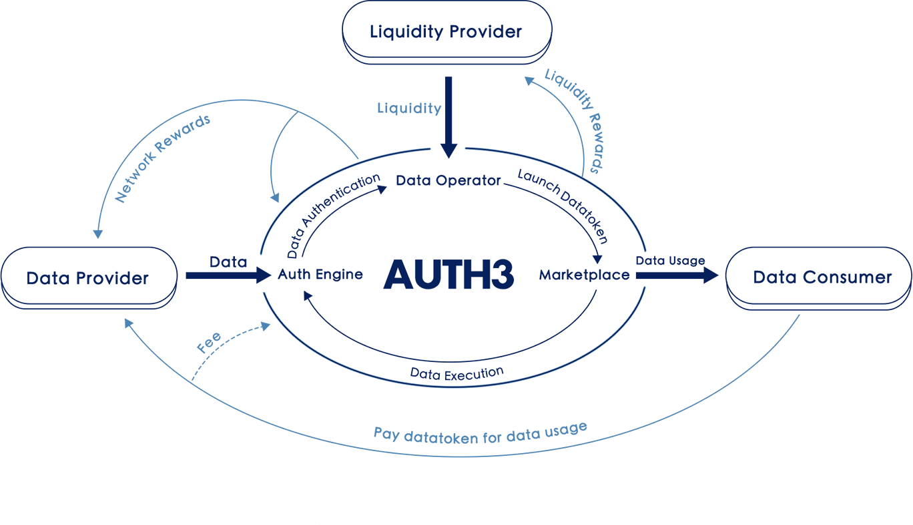

#Auth3 Whitepaper

##Introduction

##Background & Motivation

Web 3.0 has been recogonized as the next station of the Web. It is still being built and there is no established definition of what Web 3.0 is yet. When we are talking about Web 3.0, we are depicting an open, permissionless world with full-decentralization, privacy-preserving and freely value exchange. To truly understand what Web 3.0 can bring to us, we need to figure out what we are facing in the current network.

###Challenges
From Web 1.0 to Web 2.0, centralized intermediaries brought us efficient, intensive and full-featured platforms and services to coordinate, interact and trade with other counterparties. People get used to this and enjoy the convenience. However, everything comes at a price. We get more dependent on these powerful intermediaries and would like to provide our personal data and information freely. As the owner of these data, we become the property of those companies and organizations. Our data makes great profits, yet we get nothing but risk of privacy exposure and invasion.

Concretely, personal data intrinsically contains tremendous value, e.g., the user labels and portraits are essential support for industries including advertising, insurance, medical and artificial intelligence, which brings a $trillion-level marketplace. Due to lack of effective and legal ways for data usage, the value is dramatically constrained and distributed inequitably.

* User's multi-dimensional data is scattered across various Internet companies.
* The powerful companies force users to authorize and make money of these data.
* Users are completely unconscious of how the data is spreaded and used.
* There is no clear responsibilities for accidents such as users' data loss or leakage, which has actually happened frequently.

###AUTH3 wants to make a change

According to Coase theorem[COASE1966], we know that when the transaction cost is zero or low enough, no matter who the original owner of the resource is, the resource will finally flow to the most valuable usage scenario. This explains why the huge amount of data is handled by a set of centralized entities, cuz they know how to explore the value of data efficiently. In another aspect, the data scattered across the Internet results in plenty of data silos, which notably impedes the exploitation of valuable data.

Given all above, the ultimate goal of AUTH3 is to unleash the value of data, help people discover, aggregate and equitably exchange their authentic data assets, connect people and data around the world. In AUTH3, you will 1) own your data, 2) control your data, 3) entitled to sell the right of your data usage without disclosure your privacy and get paid for that. To achieve this, we will replace the current excessive centralization by a truly decentralized, autonomous and privacy-preserved marketplace, where:

* Data sovereignty and the right for usage are decoupled completely.
* Data is monetized into Data Tokens, which can be circulated for transaction and consumption of the data assets, by leveraging the booming DeFi like AMM[1] DEX[2].
* People can launch a data project, mint data tokens, and appeal for data provision (aka data staking), or can join a data project, provide/stake data as required. They earn data tokens as rewards.
* Data must always be authorized by the owners, and the data is verified to be authentic and not tampered by using privacy computing technology like TEE, MPC and federated learning.
* Privacy computing technology is also utilized to guarantee that "data is usable but not visible", which means the data itself is not directly shared but rather the comuting value.
* Data always stays on-premise, with full compliance with the data protection regulations like GDPR, CCPA, Data Security Law of the People’s Republic of China, etc.

###Values

AUTH3 is not only a network for the future, it's also
* A revolution for the fight for data sovereignty, the new paradigm of data circulation and transaction, and entirely release of data values.
* A community comprised of different people, enterprises and organizations, where every single one can coordinate and meet their data requirements, exchange data assets in an equitable and autonomous way.
* An ecosystem that sustainably spreads values and keeps long-term & healthy growing, via a community self-governed supervision and grant mechanism called Auth3 DAO.

[1] As known as "Automated Market Maker"
[2] As known as "Decentralized Exchange"
References
[COASE1966] "Coase theorem", Wikipedia. https://en.wikipedia.org/wiki/Coase_theorem

##High-level architecture

###Design Objectives
* An open data monetization platform. It aims to provide continuous and sufficient liquidity for data assets, and realize the release and continuous growth of data value.
* General private data processing scheme. It is not just the secure execution process,  but also the authentication process of data quality under the premise of privacy protection.
* Transparent and secure data aggregation and operation mechanism. It decouples data control and data operation by introducing experts or building automatic operation tools to guide data providers to build truly valuable data sets and coordinate data supply and demand.
* Flexible and extensible marketplace. According to different data types and data scenarios, it should be allowed to create different market tools to provide users (e.g., data providers, data consumers, data operators...) with a simpler way to participate. 

###The Architecture
The high-level system design of Auth3 is shown in Figure 1, the kernel of Auth3 network consists of three modules:

Figure 1: The architecture

* As the initiator of data projects, **Data Operator** will carry out a series of work related to data set construction, operation and maintenance, including defining data standards, data auth functions and other operation strategies. In the mean time, as the issuer of data token, **Data Operator** will choose (or design by itself) an appropriate economic model to tokenize the data set that it operates, and coordinate various roles in the data market. The source data may not belong to **Data Operator**, but **Data Operator** will determine the operation strategy, revenue distribution rules and other rights of data. At the beginning of Auth3 project, we plan to encourage people or institutions with operation experience in various data fields to act as early data operators. In the future, the community can spontaneously set up automatic operation facilities to build data projects after various market tools become mature. 

* **Auth Engine**, as a reliable neutral party, will undertake two main responsibilities: data authentication and secure execution. **Auth Engine** runs in the environment protected by TEE (Trust Execution Environment) to ensure the privacy and integrity of internal execution process. On the one hand, the data authentication process will execute the auth function defined by **Data Operator**, accept the source data from the data provider through a secure channel, and return the authentication result to **Data Operator** as basis for data value evaluation. On the other hand, **Auth Engine** will provide a general secure computing environment that is used to execute the algorithm defined by the consumer ensuring that the data is used without disclosure.

* **Marketplace** is the place for data value circulation where **Data Operator** can start data projects and issue data tokens, and data consumers can issue data requests and complete the secure computation of data. It will provide a series of market tools (such as token framework, transaction pools, board, etc.) to help **Data Operator**  build a dynamic data market. **Marketplace** should be a sustainable system. All kinds of infrastructure of Auth3 will provide powerful help for it, and the revenue generated in **Marketplace** will be partly used to feedback these participants in turn.

The outside part in Figure 1 is the users of Auth3 network, including **data provider**, **data consumer** and liquidity provider. **Data provider** can be large institutions or just individuals, who will continue to gain benefits by providing verifiable valuable data. **Data consumers** can explore valuable data in various kinds of data markets and pay the corresponding data token to obtain the access rights of the data. This revenue will be mainly distributed to the **data provider**, and the other part will be used to feedback other contributors in the network. **Liquidity provider** will provide liquidity for all kinds of data tokens in the network by staking Auth3 token, and obtain liquidity reward.

##Buiding blocks
